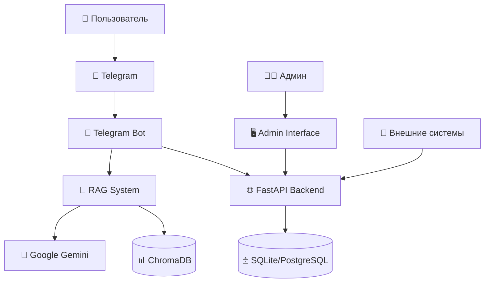
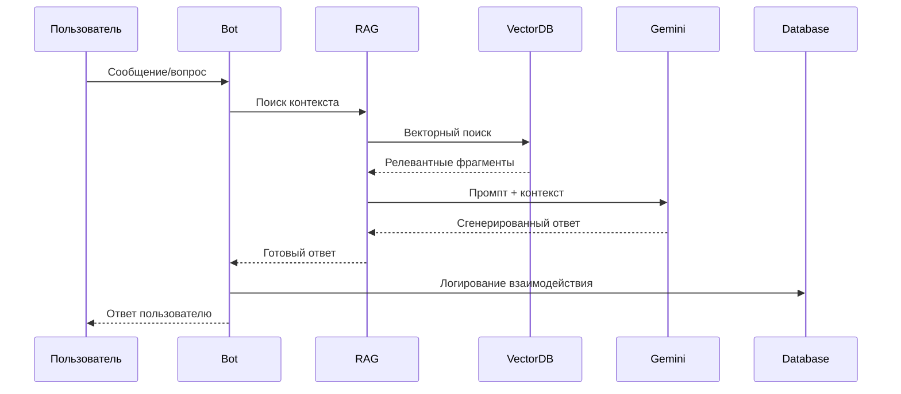
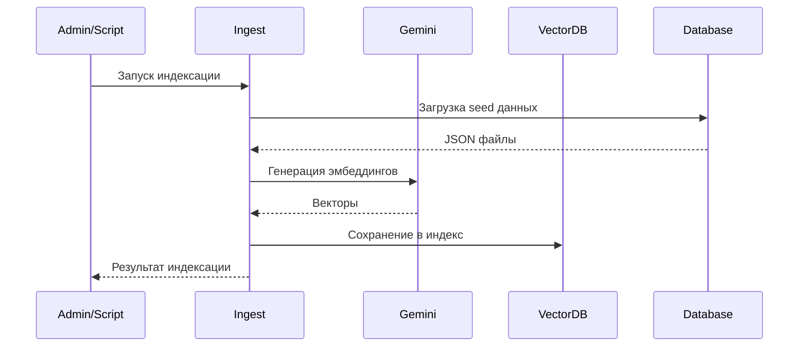
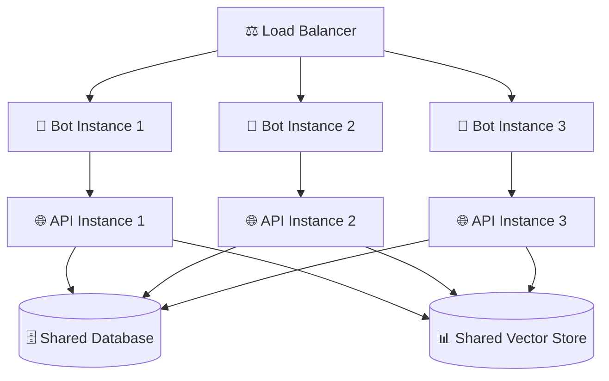
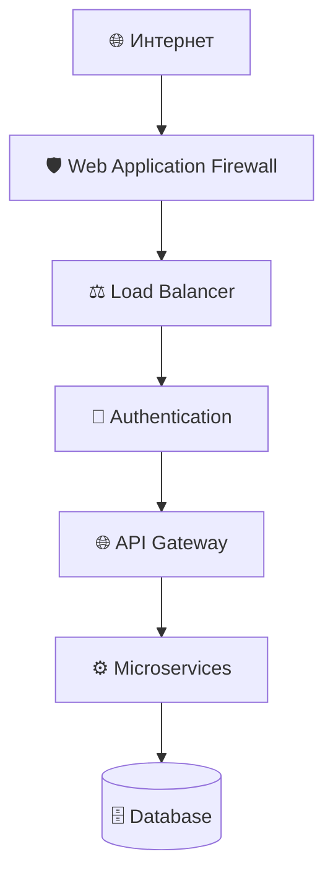
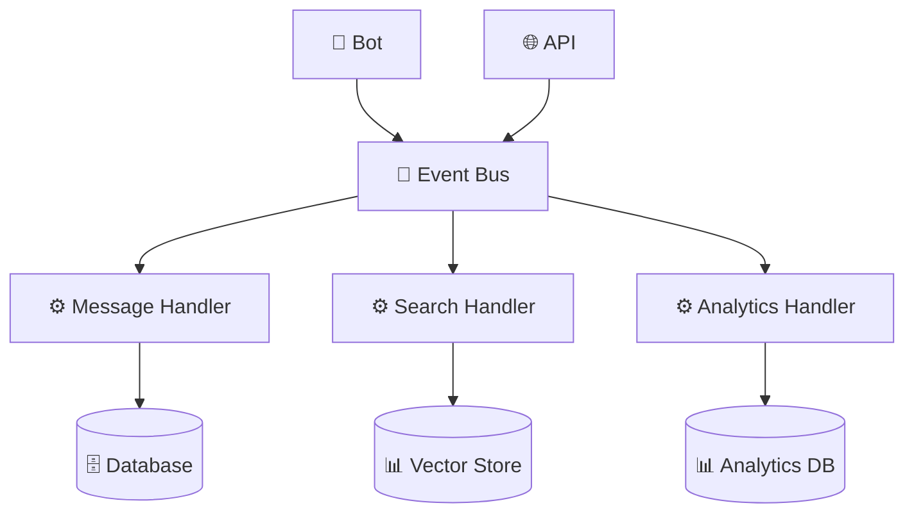
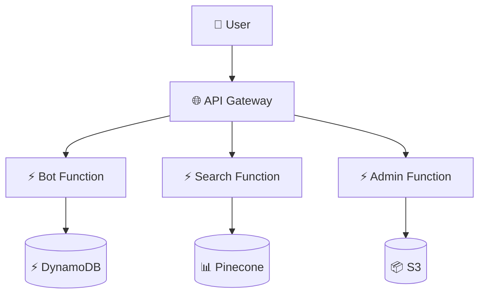

# 🏗️ Обзор архитектуры

Admissions Agent построен на основе микросервисной архитектуры с четким разделением ответственности между компонентами.

## Общая архитектура



## Основные компоненты

### 1. 🤖 Telegram Bot Layer
**Расположение**: `src/bot/`

- **Назначение**: Интерфейс взаимодействия с пользователями
- **Технологии**: aiogram 3.x
- **Ответственность**:
  - Обработка команд и сообщений
  - Навигация по меню
  - Валидация пользовательского ввода
  - Форматирование ответов

### 2. 🌐 API Backend
**Расположение**: `src/app/`

- **Назначение**: REST API для внешних интеграций
- **Технологии**: FastAPI, SQLAlchemy
- **Ответственность**:
  - CRUD операции с данными
  - Аутентификация и авторизация
  - Валидация запросов
  - Документация API

### 3. 🧠 RAG System
**Расположение**: `src/rag/`

- **Назначение**: Система поиска и генерации ответов
- **Технологии**: ChromaDB, Google Gemini
- **Ответственность**:
  - Векторизация и индексация документов
  - Семантический поиск
  - Генерация контекстных ответов
  - Контроль качества ответов

### 4. 🗄️ Data Layer
**Расположение**: `src/data/`

- **Назначение**: Управление данными
- **Технологии**: SQLAlchemy, JSON
- **Ответственность**:
  - Хранение структурированных данных
  - Seed данные для инициализации
  - Миграции базы данных

## Потоки данных

### Поток обработки пользовательского запроса



### Поток индексации данных



## Принципы архитектуры

### 1. Separation of Concerns (Разделение ответственности)

- **Bot Layer**: Только UI логика и взаимодействие с пользователем
- **API Layer**: Бизнес-логика и управление данными
- **RAG Layer**: AI и поиск информации
- **Data Layer**: Хранение и управление данными

### 2. Loose Coupling (Слабая связанность)

- Компоненты взаимодействуют через четко определенные интерфейсы
- Возможность независимого развития и тестирования
- Легкость замены отдельных компонентов

### 3. Async First

- Все операции ввода-вывода асинхронные
- Использование async/await паттернов
- Неблокирующая обработка запросов

### 4. Configuration Management

- Централизованная конфигурация через переменные окружения
- Разные конфигурации для разных сред
- Валидация конфигурации на старте

## Масштабируемость

### Горизонтальное масштабирование



### Паттерны масштабирования

1. **Stateless Design**: Все компоненты не хранят состояние
2. **Shared Nothing**: Независимые инстансы
3. **Database Clustering**: Репликация базы данных
4. **Vector Store Sharding**: Распределение векторного индекса

## Безопасность

### Слои безопасности



### Меры безопасности

1. **Аутентификация**: JWT токены, API ключи
2. **Авторизация**: Role-based access control
3. **Валидация**: Pydantic схемы
4. **Rate Limiting**: Ограничение запросов
5. **Logging**: Аудит всех операций

## Мониторинг и наблюдаемость

### Метрики

- **System Metrics**: CPU, память, диск
- **Application Metrics**: Время ответа, количество запросов
- **Business Metrics**: Количество пользователей, успешность ответов

### Логирование

```python
# Структурированное логирование
{
    "timestamp": "2024-01-01T12:00:00Z",
    "level": "INFO",
    "component": "bot.handlers",
    "user_id": 12345,
    "action": "question_asked",
    "question": "Какие программы доступны?",
    "response_time": 1.2,
    "success": true
}
```

### Трейсинг

- Distributed tracing для отслеживания запросов
- Correlation ID для связи логов
- Performance profiling

## Развертывание

### Контейнеризация

```dockerfile
# Multi-stage build
FROM python:3.11-slim as builder
WORKDIR /app
COPY pyproject.toml poetry.lock ./
RUN pip install poetry && poetry export -f requirements.txt -o requirements.txt

FROM python:3.11-slim as runtime
WORKDIR /app
COPY --from=builder /app/requirements.txt .
RUN pip install -r requirements.txt
COPY src/ ./src/
CMD ["python", "-m", "src.app.main"]
```

### Оркестрация

```yaml
# Kubernetes deployment
apiVersion: apps/v1
kind: Deployment
metadata:
  name: admissions-bot
spec:
  replicas: 3
  selector:
    matchLabels:
      app: admissions-bot
  template:
    metadata:
      labels:
        app: admissions-bot
    spec:
      containers:
      - name: bot
        image: admissions-bot:latest
        resources:
          requests:
            memory: "256Mi"
            cpu: "250m"
          limits:
            memory: "512Mi"
            cpu: "500m"
```

## Технологический стек

### Backend
- **Python 3.11+**: Основной язык
- **FastAPI**: Web framework
- **SQLAlchemy**: ORM
- **Alembic**: Database migrations
- **Pydantic**: Data validation

### AI/ML
- **Google Gemini**: LLM для генерации ответов
- **ChromaDB**: Vector database
- **Sentence Transformers**: Эмбеддинги (альтернатива)

### Bot Framework
- **aiogram 3.x**: Telegram bot framework
- **asyncio**: Асинхронное выполнение

### Infrastructure
- **Docker**: Контейнеризация
- **Docker Compose**: Локальная оркестрация
- **Kubernetes**: Продакшн оркестрация
- **PostgreSQL**: Продакшн база данных

### Monitoring
- **Prometheus**: Метрики
- **Grafana**: Визуализация
- **Sentry**: Error tracking
- **ELK Stack**: Логирование

## Альтернативные архитектуры

### Event-Driven Architecture



### Serverless Architecture



## Миграционные стратегии

### Переход на микросервисы

1. **Strangler Fig Pattern**: Постепенная замена компонентов
2. **Database per Service**: Разделение данных
3. **API Gateway**: Единая точка входа
4. **Service Mesh**: Управление коммуникацией

### Cloud Migration

1. **Lift and Shift**: Перенос как есть
2. **Re-platforming**: Использование облачных сервисов
3. **Re-architecting**: Полная переработка под облако

Эта архитектура обеспечивает баланс между простотой разработки и возможностями масштабирования, позволяя системе расти вместе с потребностями бизнеса.