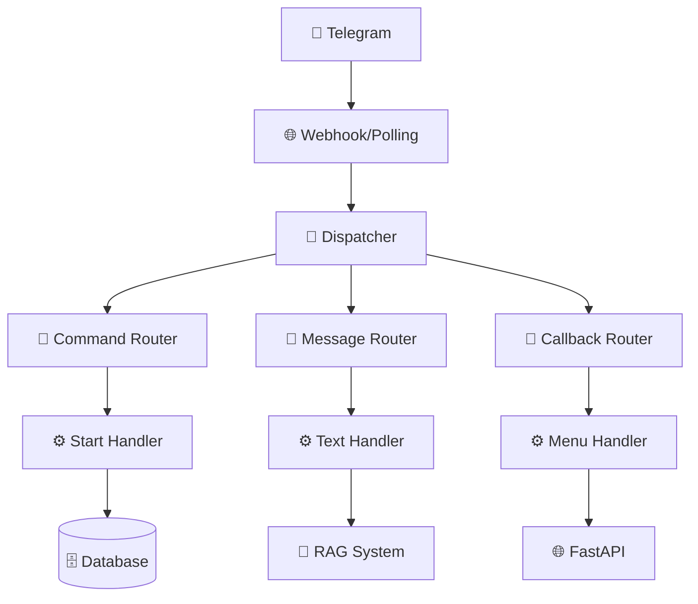

# 🤖 Telegram Bot

Подробное описание Telegram бота - основного интерфейса для взаимодействия с пользователями.

## Обзор

Telegram бот построен на основе библиотеки **aiogram 3.x** и служит основным интерфейсом для абитуриентов. Бот предоставляет интуитивное меню-ориентированное взаимодействие с интеграцией RAG системы для ответов на вопросы.

## Архитектура бота



## Структура файлов

```
src/bot/
├── __init__.py
├── runner.py              # Основной файл запуска
├── handlers.py            # Обработчики сообщений
├── keyboards.py           # Клавиатуры и кнопки
├── middleware.py          # Middleware (опционально)
└── utils.py              # Утилиты бота
```

## Основные компоненты

### 1. Запуск бота (`runner.py`)

```python
import asyncio
import logging
from aiogram import Bot, Dispatcher
from aiogram.client.default import DefaultBotProperties
from aiogram.enums import ParseMode

from app.config import settings
from .handlers import router as main_router

logger = logging.getLogger(__name__)

async def main():
    """Основная функция запуска бота."""
    
    # Инициализация бота
    bot = Bot(
        token=settings.TELEGRAM_BOT_TOKEN,
        default=DefaultBotProperties(parse_mode=ParseMode.HTML)
    )
    
    # Инициализация диспетчера
    dp = Dispatcher()
    
    # Регистрация роутеров
    dp.include_router(main_router)
    
    # Запуск бота
    try:
        logger.info("🤖 Запуск Telegram бота...")
        await dp.start_polling(bot)
    finally:
        await bot.session.close()

if __name__ == "__main__":
    asyncio.run(main())
```

### 2. Обработчики сообщений (`handlers.py`)

#### Команды и базовые обработчики

```python
from aiogram import F, Router
from aiogram.filters import Command
from aiogram.types import CallbackQuery, Message
from src.rag.genai import llm_answer
from src.rag.retriever import retrieve_context, construct_prompt
from .keyboards import main_menu_keyboard, back_to_menu_keyboard

router = Router()

@router.message(Command("start"))
async def start_handler(message: Message):
    """Обработчик команды /start."""
    user_name = message.from_user.first_name or "Абитуриент"
    
    welcome_text = f"""
👋 Здравствуйте, {user_name}!

Я — бот-ассистент приёмной комиссии ALT University.

🎯 **Что я умею:**
• Отвечаю на вопросы о поступлении
• Показываю информацию о программах обучения
• Помогаю с подачей документов
• Отвечаю на часто задаваемые вопросы

Выберите интересующий раздел или просто задайте вопрос!
    """
    
    await message.answer(
        welcome_text,
        reply_markup=main_menu_keyboard()
    )

@router.message(Command("help"))
async def help_handler(message: Message):
    """Обработчик команды /help."""
    help_text = """
🆘 **Справка по боту**

**Доступные команды:**
• /start - Главное меню
• /help - Эта справка

**Как пользоваться:**
1. Используйте кнопки меню для навигации
2. Задавайте вопросы текстом
3. Бот найдет релевантную информацию и ответит

**Разделы:**
📚 Программы обучения
❓ Часто задаваемые вопросы  
📋 Шаги поступления
📄 Необходимые документы

Просто начните с кнопки "📚 Программы обучения" или задайте любой вопрос!
    """
    
    await message.answer(
        help_text,
        reply_markup=main_menu_keyboard()
    )
```

#### Обработчик текстовых сообщений (RAG интеграция)

```python
@router.message(F.text & ~F.text.startswith('/'))
async def text_message_handler(message: Message):
    """Обработчик текстовых сообщений с RAG."""
    
    user_question = message.text
    user_id = message.from_user.id
    
    # Показываем индикатор "печатает..."
    await message.bot.send_chat_action(
        chat_id=message.chat.id,
        action="typing"
    )
    
    try:
        # Логируем вопрос пользователя
        logger.info(f"Получен вопрос от пользователя {user_id}: {user_question}")
        
        # Получаем контекст из RAG системы
        context_chunks = await retrieve_context(user_question)
        
        if not context_chunks:
            # Если контекст не найден
            await message.answer(
                "🤔 Извините, я не нашел информации по вашему вопросу.\n\n"
                "Попробуйте:\n"
                "• Переформулировать вопрос\n"
                "• Использовать меню для навигации\n"
                "• Обратиться в приёмную комиссию напрямую\n\n"
                "📞 Контакты: +7 (xxx) xxx-xx-xx",
                reply_markup=main_menu_keyboard()
            )
            return
        
        # Формируем промпт для AI
        prompt = construct_prompt(user_question, context_chunks)
        
        # Получаем ответ от AI
        ai_response = llm_answer(prompt)
        
        # Отправляем ответ пользователю
        await message.answer(
            ai_response,
            reply_markup=back_to_menu_keyboard()
        )
        
        # Логируем успешный ответ
        logger.info(f"Успешный ответ пользователю {user_id}")
        
        # Сохраняем взаимодействие в базе данных
        await log_interaction(
            user_id=user_id,
            question=user_question,
            answer=ai_response,
            context_used=len(context_chunks)
        )
        
    except Exception as e:
        logger.error(f"Ошибка при обработке сообщения: {e}")
        
        await message.answer(
            "😔 Произошла ошибка при обработке вашего вопроса.\n\n"
            "Попробуйте:\n"
            "• Задать вопрос позже\n"
            "• Использовать меню навигации\n"
            "• Обратиться в техподдержку\n\n"
            "Приносим извинения за неудобства!",
            reply_markup=main_menu_keyboard()
        )
```

#### Обработчики callback запросов (меню)

```python
@router.callback_query(F.data == "programs")
async def programs_callback(callback: CallbackQuery):
    """Показать список программ обучения."""
    
    try:
        # Получаем программы из API
        async with AsyncSessionLocal() as session:
            result = await session.execute(select(models.Program))
            programs = result.scalars().all()
        
        if not programs:
            await callback.message.edit_text(
                "📚 Программы обучения временно недоступны.\n"
                "Обратитесь в приёмную комиссию для получения актуальной информации.",
                reply_markup=back_to_menu_keyboard()
            )
            return
        
        # Формируем список программ
        programs_text = "📚 **Программы обучения ALT University:**\n\n"
        
        for program in programs:
            programs_text += f"🎓 **{program.name}**\n"
            programs_text += f"⏱ Длительность: {program.duration}\n"
            programs_text += f"💰 Стоимость: {program.cost} руб.\n"
            if program.description:
                programs_text += f"📝 {program.description[:100]}...\n"
            programs_text += "\n"
        
        programs_text += "❓ Задайте вопрос о любой программе или выберите раздел:"
        
        await callback.message.edit_text(
            programs_text,
            reply_markup=programs_keyboard(programs)
        )
        
    except Exception as e:
        logger.error(f"Ошибка при получении программ: {e}")
        await callback.message.edit_text(
            "Ошибка при загрузке программ. Попробуйте позже.",
            reply_markup=back_to_menu_keyboard()
        )
    
    await callback.answer()

@router.callback_query(F.data == "faqs")
async def faqs_callback(callback: CallbackQuery):
    """Показать часто задаваемые вопросы."""
    
    try:
        async with AsyncSessionLocal() as session:
            result = await session.execute(select(models.FAQ))
            faqs = result.scalars().all()
        
        faqs_text = "❓ **Часто задаваемые вопросы:**\n\n"
        
        for faq in faqs[:5]:  # Показываем только первые 5
            faqs_text += f"**Q: {faq.question}**\n"
            faqs_text += f"A: {faq.answer[:150]}...\n\n"
        
        faqs_text += "💬 Задайте свой вопрос или выберите раздел:"
        
        await callback.message.edit_text(
            faqs_text,
            reply_markup=faqs_keyboard(faqs)
        )
        
    except Exception as e:
        logger.error(f"Ошибка при получении FAQ: {e}")
        await callback.message.edit_text(
            "Ошибка при загрузке FAQ. Попробуйте позже.",
            reply_markup=back_to_menu_keyboard()
        )
    
    await callback.answer()

@router.callback_query(F.data == "back_to_menu")
async def back_to_menu_callback(callback: CallbackQuery):
    """Возврат в главное меню."""
    
    await callback.message.edit_text(
        "🏠 Главное меню\n\n"
        "Выберите интересующий раздел:",
        reply_markup=main_menu_keyboard()
    )
    await callback.answer()
```

### 3. Клавиатуры (`keyboards.py`)

```python
from aiogram.types import InlineKeyboardButton, InlineKeyboardMarkup

def main_menu_keyboard() -> InlineKeyboardMarkup:
    """Главное меню бота."""
    
    keyboard = [
        [
            InlineKeyboardButton(
                text="📚 Программы обучения",
                callback_data="programs"
            )
        ],
        [
            InlineKeyboardButton(
                text="❓ Часто задаваемые вопросы",
                callback_data="faqs"
            )
        ],
        [
            InlineKeyboardButton(
                text="📋 Шаги поступления",
                callback_data="steps"
            )
        ],
        [
            InlineKeyboardButton(
                text="📄 Необходимые документы",
                callback_data="documents"
            )
        ],
        [
            InlineKeyboardButton(
                text="📞 Контакты",
                callback_data="contacts"
            )
        ]
    ]
    
    return InlineKeyboardMarkup(inline_keyboard=keyboard)

def back_to_menu_keyboard() -> InlineKeyboardMarkup:
    """Кнопка возврата в главное меню."""
    
    keyboard = [
        [
            InlineKeyboardButton(
                text="🏠 Главное меню",
                callback_data="back_to_menu"
            )
        ]
    ]
    
    return InlineKeyboardMarkup(inline_keyboard=keyboard)

def programs_keyboard(programs) -> InlineKeyboardMarkup:
    """Клавиатура для выбора программы."""
    
    keyboard = []
    
    # Добавляем кнопки для каждой программы
    for program in programs[:10]:  # Максимум 10 программ
        keyboard.append([
            InlineKeyboardButton(
                text=f"🎓 {program.name}",
                callback_data=f"program_{program.id}"
            )
        ])
    
    # Кнопка возврата
    keyboard.append([
        InlineKeyboardButton(
            text="🏠 Главное меню",
            callback_data="back_to_menu"
        )
    ])
    
    return InlineKeyboardMarkup(inline_keyboard=keyboard)

def faqs_keyboard(faqs) -> InlineKeyboardMarkup:
    """Клавиатура для FAQ."""
    
    keyboard = []
    
    # Группируем FAQ по категориям
    categories = set(faq.category for faq in faqs if faq.category)
    
    for category in sorted(categories):
        keyboard.append([
            InlineKeyboardButton(
                text=f"📂 {category.title()}",
                callback_data=f"faq_category_{category}"
            )
        ])
    
    # Кнопка возврата
    keyboard.append([
        InlineKeyboardButton(
            text="🏠 Главное меню",
            callback_data="back_to_menu"
        )
    ])
    
    return InlineKeyboardMarkup(inline_keyboard=keyboard)
```

## Интеграция с RAG системой

### Обработка пользовательских вопросов

```python
async def process_user_question(user_question: str, user_id: int) -> str:
    """Обрабатывает вопрос пользователя через RAG систему."""
    
    try:
        # 1. Получаем релевантные фрагменты
        context_chunks = await retrieve_context(
            query=user_question,
            max_chunks=5,
            similarity_threshold=0.3
        )
        
        # 2. Если контекст не найден
        if not context_chunks:
            return generate_fallback_response(user_question)
        
        # 3. Формируем промпт с контекстом
        prompt = construct_prompt(user_question, context_chunks)
        
        # 4. Получаем ответ от AI
        ai_response = llm_answer(
            prompt=prompt,
            model="gemini-2.0-flash-exp",
            temperature=0.3
        )
        
        # 5. Постобработка ответа
        processed_response = post_process_response(ai_response)
        
        return processed_response
        
    except Exception as e:
        logger.error(f"Ошибка в RAG обработке: {e}")
        return "Извините, произошла ошибка. Попробуйте переформулировать вопрос."

def generate_fallback_response(question: str) -> str:
    """Генерирует резервный ответ когда контекст не найден."""
    
    fallback_responses = {
        "стоимость": "💰 Для получения актуальной информации о стоимости обучения обратитесь в приёмную комиссию.",
        "документы": "📄 Список необходимых документов можно найти в соответствующем разделе меню.",
        "сроки": "📅 Актуальные сроки подачи документов уточняйте в приёмной комиссии.",
    }
    
    for keyword, response in fallback_responses.items():
        if keyword in question.lower():
            return response
    
    return (
        "🤔 Не нашел точной информации по вашему вопросу.\n\n"
        "Рекомендую:\n"
        "• Воспользоваться меню для навигации\n"
        "• Переформулировать вопрос\n"
        "• Обратиться в приёмную комиссию\n\n"
        "📞 Контакты: admissions@alt.university"
    )
```

## Логирование и аналитика

### Система логирования

```python
import logging
from datetime import datetime
from sqlalchemy.ext.asyncio import AsyncSession
from app.models import Interaction
from app.db import AsyncSessionLocal

logger = logging.getLogger(__name__)

async def log_interaction(
    user_id: int,
    question: str,
    answer: str,
    context_used: int = 0,
    response_time: float = 0.0
):
    """Логирует взаимодействие пользователя с ботом."""
    
    try:
        async with AsyncSessionLocal() as session:
            interaction = Interaction(
                user_id=user_id,
                question=question,
                answer=answer,
                context_chunks_used=context_used,
                response_time=response_time,
                timestamp=datetime.utcnow()
            )
            
            session.add(interaction)
            await session.commit()
            
            logger.info(f"Логирование взаимодействия: user={user_id}, chunks={context_used}")
            
    except Exception as e:
        logger.error(f"Ошибка при логировании взаимодействия: {e}")

async def get_user_statistics(user_id: int) -> dict:
    """Получает статистику пользователя."""
    
    async with AsyncSessionLocal() as session:
        result = await session.execute(
            select(Interaction)
            .where(Interaction.user_id == user_id)
            .order_by(Interaction.timestamp.desc())
        )
        
        interactions = result.scalars().all()
        
        return {
            "total_questions": len(interactions),
            "last_interaction": interactions[0].timestamp if interactions else None,
            "avg_response_time": sum(i.response_time for i in interactions) / len(interactions) if interactions else 0,
            "most_common_topics": extract_topics(interactions)
        }
```

## Middleware (расширенный функционал)

```python
from aiogram import BaseMiddleware
from aiogram.types import TelegramObject
from typing import Callable, Dict, Any, Awaitable

class LoggingMiddleware(BaseMiddleware):
    """Middleware для логирования всех сообщений."""
    
    async def __call__(
        self,
        handler: Callable[[TelegramObject, Dict[str, Any]], Awaitable[Any]],
        event: TelegramObject,
        data: Dict[str, Any]
    ) -> Any:
        
        # Логирование входящего события
        logger.info(f"Получено событие: {type(event).__name__}")
        
        # Засекаем время начала обработки
        start_time = time.time()
        
        try:
            # Выполняем обработчик
            result = await handler(event, data)
            
            # Логирование успешного выполнения
            processing_time = time.time() - start_time
            logger.info(f"Событие обработано за {processing_time:.2f}s")
            
            return result
            
        except Exception as e:
            # Логирование ошибок
            logger.error(f"Ошибка при обработке события: {e}")
            raise

class RateLimitMiddleware(BaseMiddleware):
    """Middleware для ограничения частоты запросов."""
    
    def __init__(self, rate_limit: int = 10):
        self.rate_limit = rate_limit  # запросов в минуту
        self.user_requests = {}
    
    async def __call__(
        self,
        handler: Callable[[TelegramObject, Dict[str, Any]], Awaitable[Any]],
        event: TelegramObject,
        data: Dict[str, Any]
    ) -> Any:
        
        user_id = event.from_user.id if hasattr(event, 'from_user') else None
        
        if user_id:
            current_time = time.time()
            
            # Очищаем старые запросы
            if user_id in self.user_requests:
                self.user_requests[user_id] = [
                    req_time for req_time in self.user_requests[user_id]
                    if current_time - req_time < 60  # за последнюю минуту
                ]
            else:
                self.user_requests[user_id] = []
            
            # Проверяем лимит
            if len(self.user_requests[user_id]) >= self.rate_limit:
                logger.warning(f"Rate limit exceeded for user {user_id}")
                # Можно отправить сообщение о превышении лимита
                return
            
            # Добавляем текущий запрос
            self.user_requests[user_id].append(current_time)
        
        return await handler(event, data)
```

## Обработка ошибок

### Централизованная обработка ошибок

```python
class BotErrorHandler:
    """Класс для централизованной обработки ошибок бота."""
    
    @staticmethod
    async def handle_telegram_error(update, exception):
        """Обработка ошибок Telegram API."""
        
        if isinstance(exception, TelegramNetworkError):
            logger.error("Ошибка сети Telegram")
            # Пытаемся переподключиться
            await asyncio.sleep(5)
        
        elif isinstance(exception, TelegramBadRequest):
            logger.error(f"Неверный запрос к Telegram API: {exception}")
            # Логируем детали для отладки
        
        else:
            logger.error(f"Неизвестная ошибка Telegram: {exception}")
    
    @staticmethod
    async def handle_rag_error(user_id: int, question: str, exception: Exception):
        """Обработка ошибок RAG системы."""
        
        logger.error(f"Ошибка RAG для пользователя {user_id}: {exception}")
        
        # Отправляем резервный ответ
        fallback_response = (
            "🤖 Извините, у меня временные технические трудности.\n\n"
            "Попробуйте:\n"
            "• Задать вопрос позже\n"
            "• Использовать меню навигации\n"
            "• Обратиться в приёмную комиссию напрямую\n\n"
            "📞 +7 (xxx) xxx-xx-xx"
        )
        
        return fallback_response
```

## Конфигурация и настройки

### Настройки бота

```python
# В src/bot/config.py

from pydantic import BaseSettings

class BotSettings(BaseSettings):
    # Основные настройки
    bot_token: str
    webhook_url: str = None
    webhook_secret: str = None
    
    # Поведение бота
    max_message_length: int = 1000
    rate_limit_per_minute: int = 10
    response_timeout: int = 30
    
    # RAG настройки
    max_context_chunks: int = 5
    similarity_threshold: float = 0.3
    
    # Логирование
    log_level: str = "INFO"
    log_user_interactions: bool = True
    
    class Config:
        env_prefix = "BOT_"
        env_file = ".env"
```

## Тестирование бота

### Unit тесты

```python
import pytest
from unittest.mock import AsyncMock, patch
from aiogram.types import Message, User, Chat
from src.bot.handlers import start_handler, text_message_handler

@pytest.fixture
def mock_message():
    """Мок объект сообщения."""
    message = AsyncMock(spec=Message)
    message.from_user = User(id=123, is_bot=False, first_name="Test")
    message.chat = Chat(id=123, type="private")
    message.text = "Тестовое сообщение"
    return message

@pytest.mark.asyncio
async def test_start_handler(mock_message):
    """Тест обработчика команды /start."""
    
    await start_handler(mock_message)
    
    # Проверяем что ответ был отправлен
    mock_message.answer.assert_called_once()
    
    # Проверяем содержание ответа
    call_args = mock_message.answer.call_args
    assert "Здравствуйте, Test!" in call_args[0][0]

@pytest.mark.asyncio
@patch('src.bot.handlers.retrieve_context')
@patch('src.bot.handlers.llm_answer')
async def test_text_message_handler(mock_llm, mock_retrieve, mock_message):
    """Тест обработчика текстовых сообщений."""
    
    # Настраиваем моки
    mock_retrieve.return_value = ["test context"]
    mock_llm.return_value = "Test response"
    
    await text_message_handler(mock_message)
    
    # Проверяем что RAG система была вызвана
    mock_retrieve.assert_called_once_with("Тестовое сообщение")
    mock_llm.assert_called_once()
    
    # Проверяем что ответ был отправлен
    mock_message.answer.assert_called_once_with(
        "Test response",
        reply_markup=ANY
    )
```

Эта архитектура бота обеспечивает:
- **Модульность**: Четкое разделение логики
- **Масштабируемость**: Легкость добавления новых функций
- **Надежность**: Обработка ошибок и логирование
- **Пользовательский опыт**: Интуитивная навигация и быстрые ответы