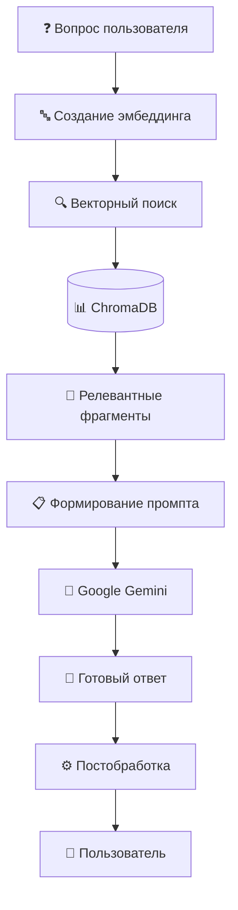

# 🧠 RAG система и AI

Подробное описание системы Retrieval-Augmented Generation (RAG) и интеграции с Google Gemini AI.

## Обзор RAG системы

RAG система объединяет поиск релевантной информации с генерацией естественных ответов, обеспечивая точные и контекстные ответы на вопросы пользователей.



## Архитектура RAG системы

### Компоненты системы

```
src/rag/
├── __init__.py
├── genai.py              # Интеграция с Google Gemini
├── retriever.py          # Поиск и извлечение контекста
├── ingest.py            # Индексация документов
├── embeddings.py        # Работа с эмбеддингами
├── prompts.py           # Шаблоны промптов
└── index/               # Векторная база данных
```

## 1. Индексация данных (`ingest.py`)

### Основной процесс индексации

```python
import json
import logging
from pathlib import Path
from typing import List, Dict, Any
import chromadb
from chromadb.config import Settings
import google.genai as genai

from app.config import settings

logger = logging.getLogger(__name__)

class DataIngestor:
    """Класс для индексации данных в векторную базу."""
    
    def __init__(self):
        self.client = chromadb.PersistentClient(
            path=settings.CHROMA_PERSIST_DIRECTORY,
            settings=Settings(anonymized_telemetry=False)
        )
        
        self.collection = self.client.get_or_create_collection(
            name=settings.CHROMA_COLLECTION_NAME,
            metadata={"description": "Admissions knowledge base"}
        )
        
        # Инициализация Gemini для эмбеддингов
        self.genai_client = genai.Client(api_key=settings.GEMINI_API_KEY)

    async def ingest_data(self):
        """Основная функция индексации всех данных."""
        
        logger.info("🔄 Начало индексации данных...")
        
        try:
            # Очищаем существующую коллекцию
            self.collection.delete()
            
            # Индексируем каждый тип данных
            await self._ingest_programs()
            await self._ingest_faqs()
            await self._ingest_steps()
            await self._ingest_documents()
            
            logger.info("✅ Индексация завершена успешно")
            
        except Exception as e:
            logger.error(f"❌ Ошибка при индексации: {e}")
            raise

    async def _ingest_programs(self):
        """Индексация программ обучения."""
        
        programs_file = Path("src/data/seed/programs.json")
        
        if not programs_file.exists():
            logger.warning("Файл programs.json не найден")
            return
        
        with open(programs_file, 'r', encoding='utf-8') as f:
            programs = json.load(f)
        
        documents = []
        metadatas = []
        ids = []
        
        for program in programs:
            # Формируем текст для индексации
            text = self._format_program_text(program)
            
            documents.append(text)
            metadatas.append({
                "type": "program",
                "id": program["id"],
                "name": program["name"],
                "category": program.get("category", "unknown")
            })
            ids.append(f"program_{program['id']}")
        
        # Создаем эмбеддинги
        embeddings = await self._create_embeddings(documents)
        
        # Добавляем в коллекцию
        self.collection.add(
            documents=documents,
            embeddings=embeddings,
            metadatas=metadatas,
            ids=ids
        )
        
        logger.info(f"✅ Проиндексировано {len(programs)} программ")

    async def _ingest_faqs(self):
        """Индексация FAQ."""
        
        faqs_file = Path("src/data/seed/faqs.json")
        
        with open(faqs_file, 'r', encoding='utf-8') as f:
            faqs = json.load(f)
        
        documents = []
        metadatas = []
        ids = []
        
        for faq in faqs:
            # Формируем текст: вопрос + ответ
            text = f"Вопрос: {faq['question']}\nОтвет: {faq['answer']}"
            
            documents.append(text)
            metadatas.append({
                "type": "faq",
                "id": faq["id"],
                "category": faq.get("category", "general"),
                "keywords": faq.get("keywords", [])
            })
            ids.append(f"faq_{faq['id']}")
        
        embeddings = await self._create_embeddings(documents)
        
        self.collection.add(
            documents=documents,
            embeddings=embeddings,
            metadatas=metadatas,
            ids=ids
        )
        
        logger.info(f"✅ Проиндексировано {len(faqs)} FAQ")

    def _format_program_text(self, program: Dict[str, Any]) -> str:
        """Форматирует программу в текст для индексации."""
        
        text_parts = [
            f"Программа: {program['name']}",
            f"Описание: {program.get('description', '')}",
            f"Длительность: {program.get('duration', '')}",
            f"Стоимость: {program.get('cost', '')} рублей",
        ]
        
        if program.get('requirements'):
            requirements = ', '.join(program['requirements'])
            text_parts.append(f"Требования: {requirements}")
        
        if program.get('career_prospects'):
            text_parts.append(f"Карьерные перспективы: {program['career_prospects']}")
        
        return '\n'.join(text_parts)

    async def _create_embeddings(self, texts: List[str]) -> List[List[float]]:
        """Создает эмбеддинги для списка текстов."""
        
        try:
            # Используем Gemini для создания эмбеддингов
            embeddings = []
            
            for text in texts:
                response = await self.genai_client.aembed_content(
                    model=settings.GEMINI_EMBEDDING_MODEL,
                    content=text
                )
                embeddings.append(response.embedding)
            
            return embeddings
            
        except Exception as e:
            logger.error(f"Ошибка при создании эмбеддингов: {e}")
            raise

# Основная функция для запуска индексации
async def ingest_data():
    """Запускает процесс индексации данных."""
    
    ingestor = DataIngestor()
    await ingestor.ingest_data()
```

## 2. Поиск и извлечение (`retriever.py`)

### Система поиска контекста

```python
import logging
from typing import List, Dict, Any, Optional
import chromadb
from chromadb.config import Settings
import google.genai as genai

from app.config import settings

logger = logging.getLogger(__name__)

class ContextRetriever:
    """Класс для поиска релевантного контекста."""
    
    def __init__(self):
        self.client = chromadb.PersistentClient(
            path=settings.CHROMA_PERSIST_DIRECTORY,
            settings=Settings(anonymized_telemetry=False)
        )
        
        try:
            self.collection = self.client.get_collection(
                name=settings.CHROMA_COLLECTION_NAME
            )
        except ValueError:
            logger.error("Коллекция не найдена. Запустите индексацию данных.")
            self.collection = None
        
        self.genai_client = genai.Client(api_key=settings.GEMINI_API_KEY)

    async def retrieve_context(
        self,
        query: str,
        max_chunks: int = 5,
        similarity_threshold: float = 0.3,
        filters: Optional[Dict[str, str]] = None
    ) -> List[Dict[str, Any]]:
        """
        Извлекает релевантный контекст для запроса.
        
        Args:
            query: Пользовательский запрос
            max_chunks: Максимальное количество фрагментов
            similarity_threshold: Минимальный порог схожести
            filters: Фильтры по метаданным
        
        Returns:
            Список релевантных фрагментов с метаданными
        """
        
        if not self.collection:
            logger.error("Коллекция недоступна")
            return []
        
        try:
            # Создаем эмбеддинг для запроса
            query_embedding = await self._create_query_embedding(query)
            
            # Выполняем поиск
            results = self.collection.query(
                query_embeddings=[query_embedding],
                n_results=max_chunks * 2,  # Берем больше для фильтрации
                where=filters or {},
                include=["documents", "metadatas", "distances"]
            )
            
            # Обрабатываем результаты
            context_chunks = self._process_search_results(
                results, 
                similarity_threshold,
                max_chunks
            )
            
            logger.info(f"Найдено {len(context_chunks)} релевантных фрагментов")
            
            return context_chunks
            
        except Exception as e:
            logger.error(f"Ошибка при поиске контекста: {e}")
            return []

    async def _create_query_embedding(self, query: str) -> List[float]:
        """Создает эмбеддинг для пользовательского запроса."""
        
        try:
            response = await self.genai_client.aembed_content(
                model=settings.GEMINI_EMBEDDING_MODEL,
                content=query
            )
            return response.embedding
            
        except Exception as e:
            logger.error(f"Ошибка при создании эмбеддинга запроса: {e}")
            raise

    def _process_search_results(
        self,
        results: Dict[str, Any],
        similarity_threshold: float,
        max_chunks: int
    ) -> List[Dict[str, Any]]:
        """Обрабатывает результаты поиска."""
        
        if not results['documents'] or not results['documents'][0]:
            return []
        
        documents = results['documents'][0]
        metadatas = results['metadatas'][0]
        distances = results['distances'][0]
        
        context_chunks = []
        
        for doc, metadata, distance in zip(documents, metadatas, distances):
            # Преобразуем расстояние в схожесть (cosine similarity)
            similarity = 1 - distance
            
            if similarity >= similarity_threshold:
                context_chunks.append({
                    'content': doc,
                    'metadata': metadata,
                    'similarity': similarity,
                    'source': self._get_source_info(metadata)
                })
        
        # Сортируем по релевантности
        context_chunks.sort(key=lambda x: x['similarity'], reverse=True)
        
        return context_chunks[:max_chunks]

    def _get_source_info(self, metadata: Dict[str, Any]) -> str:
        """Получает информацию об источнике фрагмента."""
        
        doc_type = metadata.get('type', 'unknown')
        
        if doc_type == 'program':
            return f"Программа: {metadata.get('name', 'Неизвестная')}"
        elif doc_type == 'faq':
            return "FAQ"
        elif doc_type == 'step':
            return "Шаги поступления"
        elif doc_type == 'document':
            return "Документы"
        else:
            return "База знаний"

# Функции-утилиты
async def retrieve_context(query: str, **kwargs) -> List[Dict[str, Any]]:
    """Упрощенная функция для получения контекста."""
    
    retriever = ContextRetriever()
    return await retriever.retrieve_context(query, **kwargs)

def construct_prompt(query: str, context_chunks: List[Dict[str, Any]]) -> str:
    """Конструирует промпт для AI на основе запроса и контекста."""
    
    if not context_chunks:
        return f"Ответь на вопрос: {query}"
    
    # Формируем контекст
    context_text = "\n\n".join([
        f"[{chunk['source']}]\n{chunk['content']}"
        for chunk in context_chunks
    ])
    
    prompt = f"""
Ты — ассистент приёмной комиссии ALT University.

ВОПРОС ПОЛЬЗОВАТЕЛЯ:
{query}

КОНТЕКСТ ИЗ БАЗЫ ЗНАНИЙ:
{context_text}

ИНСТРУКЦИИ:
1. Отвечай строго на основе предоставленного КОНТЕКСТА
2. Если информации недостаточно — честно скажи об этом
3. Отвечай на русском языке, дружелюбно и профессионально
4. Используй конкретные данные из контекста (цифры, даты, названия)
5. В конце предложи дополнительную помощь

Ответ:
    """
    
    return prompt
```

## 3. Интеграция с Google Gemini (`genai.py`)

### Генерация ответов

```python
import google.genai as genai
from typing import Optional, Dict, Any
import logging
import asyncio

from app.config import settings

logger = logging.getLogger(__name__)

class GeminiClient:
    """Клиент для работы с Google Gemini API."""
    
    def __init__(self):
        self.client = genai.Client(api_key=settings.GEMINI_API_KEY)
        
        # Настройки генерации по умолчанию
        self.default_config = genai.GenerationConfig(
            temperature=0.3,
            top_p=0.8,
            top_k=40,
            max_output_tokens=1000,
        )

    async def generate_answer(
        self,
        prompt: str,
        model: str = None,
        config: Optional[genai.GenerationConfig] = None,
        safety_settings: Optional[Dict[str, Any]] = None
    ) -> str:
        """
        Генерирует ответ на основе промпта.
        
        Args:
            prompt: Промпт для генерации
            model: Модель для использования
            config: Настройки генерации
            safety_settings: Настройки безопасности
        
        Returns:
            Сгенерированный ответ
        """
        
        model = model or settings.GEMINI_DEFAULT_MODEL
        config = config or self.default_config
        
        try:
            response = await self.client.agenerate_content(
                model=model,
                contents=prompt,
                config=config,
                safety_settings=safety_settings or self._get_default_safety_settings()
            )
            
            if response.candidates:
                answer = response.candidates[0].content.parts[0].text
                return self._post_process_answer(answer)
            else:
                logger.warning("Gemini не вернул кандидатов ответов")
                return "Извините, не удалось сгенерировать ответ."
            
        except Exception as e:
            logger.error(f"Ошибка при генерации ответа: {e}")
            return self._get_fallback_response()

    async def create_embedding(self, text: str, model: str = None) -> List[float]:
        """Создает эмбеддинг для текста."""
        
        model = model or settings.GEMINI_EMBEDDING_MODEL
        
        try:
            response = await self.client.aembed_content(
                model=model,
                content=text
            )
            return response.embedding
            
        except Exception as e:
            logger.error(f"Ошибка при создании эмбеддинга: {e}")
            raise

    def _get_default_safety_settings(self) -> Dict[str, Any]:
        """Возвращает настройки безопасности по умолчанию."""
        
        return {
            genai.HarmCategory.HARM_CATEGORY_HARASSMENT: genai.HarmBlockThreshold.BLOCK_MEDIUM_AND_ABOVE,
            genai.HarmCategory.HARM_CATEGORY_HATE_SPEECH: genai.HarmBlockThreshold.BLOCK_MEDIUM_AND_ABOVE,
            genai.HarmCategory.HARM_CATEGORY_SEXUALLY_EXPLICIT: genai.HarmBlockThreshold.BLOCK_MEDIUM_AND_ABOVE,
            genai.HarmCategory.HARM_CATEGORY_DANGEROUS_CONTENT: genai.HarmBlockThreshold.BLOCK_MEDIUM_AND_ABOVE,
        }

    def _post_process_answer(self, answer: str) -> str:
        """Постобработка сгенерированного ответа."""
        
        # Удаляем лишние пробелы и переносы
        answer = answer.strip()
        
        # Ограничиваем длину ответа для Telegram
        max_length = 4000
        if len(answer) > max_length:
            answer = answer[:max_length - 3] + "..."
        
        # Добавляем эмодзи если их нет
        if not any(char for char in answer if ord(char) > 127):
            answer = "💡 " + answer
        
        return answer

    def _get_fallback_response(self) -> str:
        """Возвращает резервный ответ при ошибке."""
        
        return (
            "🤖 Извините, произошла техническая ошибка.\n\n"
            "Попробуйте:\n"
            "• Переформулировать вопрос\n"
            "• Воспользоваться меню навигации\n"
            "• Обратиться в приёмную комиссию\n\n"
            "📞 Контакты: admissions@alt.university"
        )

# Глобальный экземпляр клиента
_gemini_client = None

def get_gemini_client() -> GeminiClient:
    """Получает глобальный экземпляр Gemini клиента."""
    
    global _gemini_client
    if _gemini_client is None:
        _gemini_client = GeminiClient()
    return _gemini_client

# Упрощенные функции для использования
async def llm_answer(prompt: str, model: str = None) -> str:
    """Упрощенная функция для получения ответа от LLM."""
    
    client = get_gemini_client()
    return await client.generate_answer(prompt, model)

async def create_embedding(text: str, model: str = None) -> List[float]:
    """Упрощенная функция для создания эмбеддинга."""
    
    client = get_gemini_client()
    return await client.create_embedding(text, model)
```

## 4. Продвинутые возможности RAG

### Гибридный поиск

```python
class HybridRetriever(ContextRetriever):
    """Гибридный поиск: векторный + текстовый."""
    
    def __init__(self):
        super().__init__()
        self.keyword_weights = {
            'программы': 1.2,
            'стоимость': 1.1,
            'поступление': 1.1,
            'документы': 1.0,
        }

    async def hybrid_search(
        self,
        query: str,
        max_chunks: int = 5,
        vector_weight: float = 0.7,
        keyword_weight: float = 0.3
    ) -> List[Dict[str, Any]]:
        """Гибридный поиск комбинирующий векторный и ключевой поиск."""
        
        # Векторный поиск
        vector_results = await self.retrieve_context(query, max_chunks * 2)
        
        # Ключевой поиск
        keyword_results = await self._keyword_search(query, max_chunks * 2)
        
        # Объединяем результаты
        combined_results = self._combine_search_results(
            vector_results, 
            keyword_results,
            vector_weight,
            keyword_weight
        )
        
        return combined_results[:max_chunks]

    async def _keyword_search(self, query: str, max_results: int) -> List[Dict[str, Any]]:
        """Поиск по ключевым словам."""
        
        # Извлекаем ключевые слова из запроса
        keywords = self._extract_keywords(query.lower())
        
        # Поиск в коллекции по метаданным и содержимому
        all_results = self.collection.get(
            include=["documents", "metadatas"]
        )
        
        scored_results = []
        
        for doc, metadata in zip(all_results['documents'], all_results['metadatas']):
            score = self._calculate_keyword_score(doc.lower(), keywords)
            
            if score > 0:
                scored_results.append({
                    'content': doc,
                    'metadata': metadata,
                    'similarity': score,
                    'source': self._get_source_info(metadata)
                })
        
        # Сортируем по релевантности
        scored_results.sort(key=lambda x: x['similarity'], reverse=True)
        
        return scored_results[:max_results]

    def _extract_keywords(self, query: str) -> List[str]:
        """Извлекает ключевые слова из запроса."""
        
        # Простая реализация - можно улучшить с помощью NLP
        stop_words = {'как', 'что', 'где', 'когда', 'почему', 'сколько', 'какие', 'и', 'в', 'на', 'с', 'по'}
        
        words = query.split()
        keywords = [word for word in words if word not in stop_words and len(word) > 2]
        
        return keywords

    def _calculate_keyword_score(self, text: str, keywords: List[str]) -> float:
        """Вычисляет релевантность по ключевым словам."""
        
        score = 0.0
        
        for keyword in keywords:
            count = text.count(keyword)
            weight = self.keyword_weights.get(keyword, 1.0)
            score += count * weight
        
        # Нормализуем по длине текста
        return score / (len(text.split()) + 1)
```

### Контроль качества ответов

```python
class QualityController:
    """Контроллер качества для RAG ответов."""
    
    def __init__(self):
        self.gemini_client = get_gemini_client()

    async def validate_answer(
        self,
        question: str,
        answer: str,
        context: List[Dict[str, Any]]
    ) -> Dict[str, Any]:
        """Валидирует качество сгенерированного ответа."""
        
        validation_result = {
            'is_valid': True,
            'issues': [],
            'confidence': 1.0,
            'suggestions': []
        }
        
        # 1. Проверка на галлюцинации
        hallucination_check = await self._check_hallucinations(answer, context)
        if not hallucination_check['passed']:
            validation_result['is_valid'] = False
            validation_result['issues'].append('potential_hallucination')
            validation_result['confidence'] *= 0.5
        
        # 2. Проверка релевантности
        relevance_score = await self._check_relevance(question, answer)
        if relevance_score < 0.6:
            validation_result['issues'].append('low_relevance')
            validation_result['confidence'] *= 0.7
        
        # 3. Проверка полноты
        completeness_score = self._check_completeness(question, answer)
        if completeness_score < 0.5:
            validation_result['issues'].append('incomplete_answer')
            validation_result['suggestions'].append('Ответ может быть неполным')
        
        return validation_result

    async def _check_hallucinations(
        self,
        answer: str,
        context: List[Dict[str, Any]]
    ) -> Dict[str, Any]:
        """Проверяет ответ на галлюцинации."""
        
        context_text = '\n'.join([chunk['content'] for chunk in context])
        
        prompt = f"""
Проверь, содержит ли ОТВЕТ информацию, которой нет в КОНТЕКСТЕ.

КОНТЕКСТ:
{context_text}

ОТВЕТ:
{answer}

Ответь только 'ДА' если ответ основан на контексте, или 'НЕТ' если содержит выдуманную информацию.
        """
        
        try:
            response = await self.gemini_client.generate_answer(prompt)
            passed = 'да' in response.lower()
            
            return {
                'passed': passed,
                'details': response
            }
            
        except Exception as e:
            logger.error(f"Ошибка при проверке галлюцинаций: {e}")
            return {'passed': True, 'details': 'Проверка недоступна'}

    async def _check_relevance(self, question: str, answer: str) -> float:
        """Проверяет релевантность ответа вопросу."""
        
        prompt = f"""
Оцени релевантность ОТВЕТА к ВОПРОСУ по шкале от 0 до 1.

ВОПРОС: {question}
ОТВЕТ: {answer}

Ответь только числом от 0.0 до 1.0.
        """
        
        try:
            response = await self.gemini_client.generate_answer(prompt)
            score = float(response.strip())
            return max(0.0, min(1.0, score))
            
        except (ValueError, Exception):
            return 0.8  # Средняя оценка при ошибке
```

## 5. Мониторинг и метрики RAG

### Система метрик

```python
import time
from typing import Dict, List
from dataclasses import dataclass
from datetime import datetime, timedelta
import json

@dataclass
class RAGMetrics:
    """Метрики производительности RAG системы."""
    
    query_count: int = 0
    avg_response_time: float = 0.0
    avg_context_chunks: float = 0.0
    avg_similarity_score: float = 0.0
    success_rate: float = 0.0
    error_count: int = 0
    
    # Метрики качества
    user_satisfaction: float = 0.0
    answer_relevance: float = 0.0
    hallucination_rate: float = 0.0

class RAGMonitor:
    """Мониторинг RAG системы."""
    
    def __init__(self):
        self.metrics = RAGMetrics()
        self.query_history = []
        self.start_time = datetime.now()

    async def log_query(
        self,
        query: str,
        response: str,
        context_chunks: List[Dict[str, Any]],
        response_time: float,
        success: bool = True
    ):
        """Логирует выполнение запроса."""
        
        entry = {
            'timestamp': datetime.now().isoformat(),
            'query': query,
            'response': response,
            'context_chunks_count': len(context_chunks),
            'avg_similarity': sum(c.get('similarity', 0) for c in context_chunks) / len(context_chunks) if context_chunks else 0,
            'response_time': response_time,
            'success': success
        }
        
        self.query_history.append(entry)
        
        # Обновляем метрики
        await self._update_metrics()

    async def _update_metrics(self):
        """Обновляет агрегированные метрики."""
        
        if not self.query_history:
            return
        
        recent_queries = [
            q for q in self.query_history
            if datetime.fromisoformat(q['timestamp']) > datetime.now() - timedelta(hours=24)
        ]
        
        if not recent_queries:
            return
        
        self.metrics.query_count = len(recent_queries)
        self.metrics.avg_response_time = sum(q['response_time'] for q in recent_queries) / len(recent_queries)
        self.metrics.avg_context_chunks = sum(q['context_chunks_count'] for q in recent_queries) / len(recent_queries)
        self.metrics.avg_similarity_score = sum(q['avg_similarity'] for q in recent_queries) / len(recent_queries)
        self.metrics.success_rate = sum(1 for q in recent_queries if q['success']) / len(recent_queries)
        self.metrics.error_count = sum(1 for q in recent_queries if not q['success'])

    def get_performance_report(self) -> Dict[str, Any]:
        """Генерирует отчет о производительности."""
        
        uptime = (datetime.now() - self.start_time).total_seconds() / 3600  # в часах
        
        return {
            'uptime_hours': round(uptime, 2),
            'total_queries': len(self.query_history),
            'recent_24h_metrics': {
                'query_count': self.metrics.query_count,
                'avg_response_time': round(self.metrics.avg_response_time, 3),
                'avg_context_chunks': round(self.metrics.avg_context_chunks, 2),
                'avg_similarity_score': round(self.metrics.avg_similarity_score, 3),
                'success_rate': round(self.metrics.success_rate, 3),
                'error_count': self.metrics.error_count
            },
            'system_health': self._assess_system_health()
        }

    def _assess_system_health(self) -> str:
        """Оценивает здоровье системы."""
        
        if self.metrics.success_rate >= 0.95 and self.metrics.avg_response_time < 2.0:
            return "excellent"
        elif self.metrics.success_rate >= 0.90 and self.metrics.avg_response_time < 3.0:
            return "good"
        elif self.metrics.success_rate >= 0.80:
            return "fair"
        else:
            return "poor"

# Глобальный монитор
rag_monitor = RAGMonitor()
```

## 6. Оптимизация и настройка

### Конфигурационные параметры

```python
# В config.py
class RAGSettings:
    # Поиск
    MAX_CONTEXT_CHUNKS: int = 5
    SIMILARITY_THRESHOLD: float = 0.3
    CHUNK_SIZE: int = 1000
    CHUNK_OVERLAP: int = 200
    
    # Генерация
    TEMPERATURE: float = 0.3
    MAX_OUTPUT_TOKENS: int = 1000
    TOP_P: float = 0.8
    TOP_K: int = 40
    
    # Модели
    DEFAULT_MODEL: str = "gemini-2.0-flash-exp"
    PRO_MODEL: str = "gemini-2.0-pro-exp"
    EMBEDDING_MODEL: str = "text-embedding-004"
    
    # Производительность
    CACHE_TTL: int = 300  # 5 минут
    MAX_CONCURRENT_REQUESTS: int = 10
    RETRY_ATTEMPTS: int = 3
    
    # Качество
    ENABLE_QUALITY_CHECK: bool = True
    HALLUCINATION_CHECK: bool = True
    MIN_RELEVANCE_SCORE: float = 0.6
```

### Кеширование

```python
import hashlib
from typing import Optional
import redis
import json

class RAGCache:
    """Кеш для RAG ответов."""
    
    def __init__(self, redis_url: str = "redis://localhost:6379"):
        self.redis_client = redis.from_url(redis_url)
        self.ttl = settings.CACHE_TTL

    def _generate_cache_key(self, query: str, context_hash: str) -> str:
        """Генерирует ключ кеша."""
        
        combined = f"{query}:{context_hash}"
        return f"rag_cache:{hashlib.md5(combined.encode()).hexdigest()}"

    def _hash_context(self, context_chunks: List[Dict[str, Any]]) -> str:
        """Создает хеш контекста."""
        
        context_str = json.dumps([c['content'] for c in context_chunks], sort_keys=True)
        return hashlib.md5(context_str.encode()).hexdigest()

    async def get_cached_response(
        self,
        query: str,
        context_chunks: List[Dict[str, Any]]
    ) -> Optional[str]:
        """Получает кешированный ответ."""
        
        try:
            context_hash = self._hash_context(context_chunks)
            cache_key = self._generate_cache_key(query, context_hash)
            
            cached_response = self.redis_client.get(cache_key)
            if cached_response:
                return cached_response.decode('utf-8')
            
        except Exception as e:
            logger.warning(f"Ошибка при получении из кеша: {e}")
        
        return None

    async def cache_response(
        self,
        query: str,
        context_chunks: List[Dict[str, Any]],
        response: str
    ):
        """Кеширует ответ."""
        
        try:
            context_hash = self._hash_context(context_chunks)
            cache_key = self._generate_cache_key(query, context_hash)
            
            self.redis_client.setex(
                cache_key,
                self.ttl,
                response.encode('utf-8')
            )
            
        except Exception as e:
            logger.warning(f"Ошибка при сохранении в кеш: {e}")
```

Эта RAG система обеспечивает:
- **Точность**: Поиск релевантного контекста
- **Качество**: Контроль галлюцинаций и валидация ответов
- **Производительность**: Кеширование и оптимизация
- **Мониторинг**: Детальная аналитика работы системы
- **Масштабируемость**: Гибридный поиск и оптимизация запросов